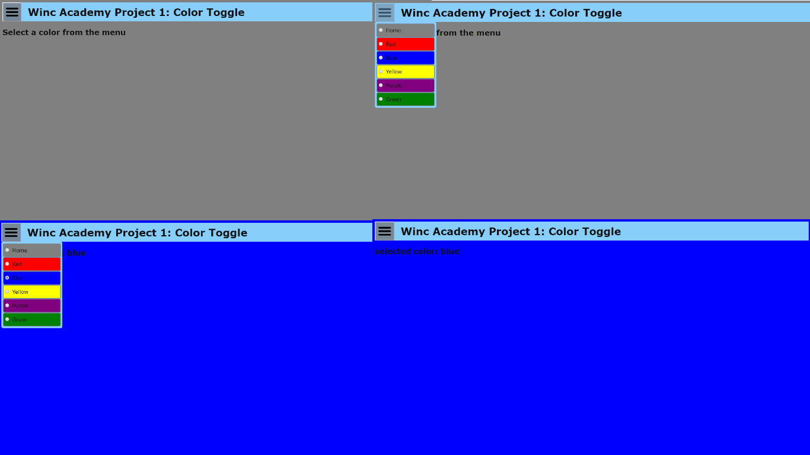

# Project: KleurenToggle 
###### Clone of download het project van Github. Je kunt gelijk starten door index.html te openen.

### Project doel
Maak een keuzemenu waarmee je de achtergrondkleur van je webpagina kunt veranderen.
Het doel van het project is om vertrouwd te raken met Vanilla Javascript, DOM manipulatie en HTML/CSS. De app is gemaakt in de eerste week van de opleiding.

### Project eisen
- [x] Als gebruiker wil ik op een hamburger-icoon kunnen klikken dat uitklapt als ik er op klik.
- [x] Als gebruiker wil ik in het uitgeklapte menu een keuze hebben aan kleuren (uitgeschreven in tekst). Elk item in het menu is één kleur. 
- [x] Als gebruiker wil ik op één van de kleuren kunnen klikken. 
- [x] Wanneer ik als gebruiker op de kleur in het menu heb geklikt verandert de achtergrondkleur van de gehele pagina in de aangeklikte kleur.
- [x] Wanneer ik als gebruiker op de kleur in het menu klik, klapt het menu weer terug in.

### Bonus 
- [x] Als gebruiker wil ik niet alleen de kleurennamen lezen, ik wil ook de kleuren kunnen zien in het menu. Elke "rij" in het menu heeft toont een kleur.
- [x] Als gebruiker wil ik op een radiobutton kunnen klikken van de kleur van mijn keuze, waardoor ik aan de radiobutton zie wat de huidige kleur is die "actief" is op dit moment.
- [x] Als gebruiker wil ik de naast de veranderende achtergrondkleur ook de uitgeschreven naam van de achtergrondkleur op de achtergrond zien wanneer ik deze heb aangeklikt. 

### Credits
Winc Academy Front End Course.
